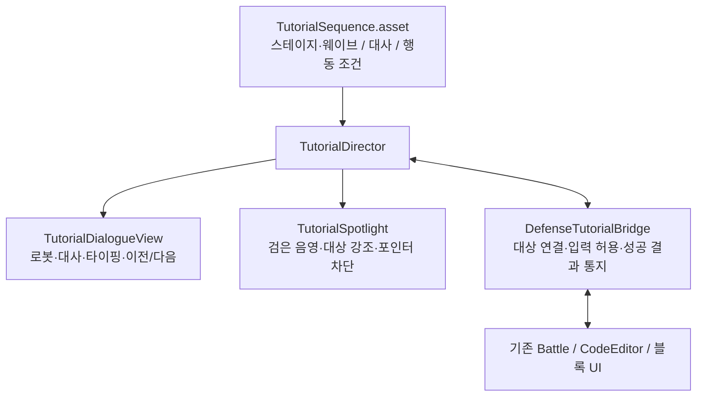

# 튜토리얼 구현 아키텍처 설계서

작성일: 2026-10-07  
대상: CodingGame / Unity 6 / 기존 uGUI·TextMeshPro UI  
상태: 시스템 구현 완료. 실제 대사와 유도할 행동은 추후 작성한다.

## 1. 요구사항과 결정

| 요구사항 | 설계 결정 |
|---|---|
| 스테이지-웨이브 표시 | `1-1`, `1-2`, `2-1` 형식. 내부 단계 번호와 구분한다. |
| 설명 로봇이 대화하듯 안내 | 전투 로봇과 별개인 안내 캐릭터의 아이콘·이름·대사를 표시한다. |
| 임시 UI, 나중에 교체 | 씬에 배치한 `TutorialOverlay.prefab`의 그림·레이아웃을 교체한다. 진행 로직과 대사 데이터는 유지한다. |
| TypeSpeed 기본값 3, Range 사용 | `typeSpeed = 3f`, 단위는 **초당 글자 수**. Inspector에 `[Range(1f, 20f)]`를 적용한다. |
| 이전으로 돌아가면 타이핑 재출력 금지 | 한번 표시를 시작한 대사는 다시 방문할 때 전체 문장을 즉시 표시한다. |
| 세모 버튼의 역할 | 왼쪽은 이전 텍스트, 오른쪽은 다음 텍스트. 스테이지·웨이브 이동이나 게임 행동 실행 버튼으로 사용하지 않는다. |
| 원하는 행동 외 영역 검은 음영 | 대상만 뚫린 검은 반투명 오버레이와 입력 제한을 함께 적용한다. |
| 행동유도 파일 저장 | Unity `ScriptableObject`의 `.asset`에 대사·대상 식별자·완료 조건을 저장한다. |
| 행동은 나중에 지정 | Inspector에서 대상·동작·완료 신호를 연결할 수 있는 구조를 만든다. 특정 로봇이나 블록을 필수 행동으로 하드코딩하지 않는다. |

`typeSpeed`는 초당 공개할 글자 수다. 기본값 3은 초당 3글자이며, Inspector에서 1~20으로 조정한다.

## 2. 참고 자료

- [tutorial-1.png](tutorial-1.png): 별도 캐릭터가 사용자에게 말을 거는 안내 방식.
- [tutorial-2.png](tutorial-2.png): 왼쪽 아이콘, 이름, 대화 본문, 오른쪽 이전·다음 버튼의 구성.
- [tutorial-3.png](tutorial-3.png): 행동 대상 강조와 주변 영역 어둡게 처리.
- [사용자 제공 참고 영상](https://www.youtube.com/shorts/lU3lnJI3NY8): 추후 연출 비교용. 설계 작성 시 영상 페이지 로딩이 제한되어 영상의 재생 동작·타이밍은 확인하지 못했다. 아래 동작 규칙은 사용자 요구와 확인한 이미지에 근거한 설계다.

## 3. 현재 코드와 연결 지점

현재 프로젝트를 확인한 결과다. 아래 연결 지점에 튜토리얼용 통지와 입력 허용 검사를 추가한다.

| 기존 코드 | 현재 역할 | 튜토리얼 연결 |
|---|---|---|
| `DefenseBattle` | 배치·선택·전투 시작·재시작·입력 처리 | 스테이지/웨이브 전환 전달, 허용된 게임 명령인지 검사, 성공한 행동 통지 |
| `DefenseSimulation` | 전투 상태와 실제 게임 결과 | 완료 조건의 최종 근거. 튜토리얼 UI를 직접 참조하지 않는다. |
| `DefenseCodeEditor` | 로봇 코드 패널 열기와 코드 적용 | 패널이 열린 뒤 통지, `ApplyProgram` 성공 후 통지 |
| `CommandCodingPanel`, `CommandDropZone` | 블록 편집과 연결 | 편집 결과가 유효하게 반영된 뒤 통지 |
| `DefensePlayerHUD` | 스테이지·웨이브 표시와 버튼 | 진행 위치 표시를 `스테이지-웨이브` 형식으로 통일 |
| `DefenseAttackPreview` | 코드 실행 미리보기 | 관찰 단계에서 미리보기 실행을 허용할지 제어 |

현재 코드 편집기는 **자동 적용** 방식이다. 따라서 실제 튜토리얼 작성 시 존재하지 않는 “코드 적용 버튼” 클릭을 요구하지 않는다. 필요한 블록 연결과 자동 적용 성공을 완료 조건으로 사용한다.

`DefenseBattle.Update()`는 마우스와 키보드를 직접 읽는다. 검은 UI를 씌우는 것만으로 Space, Tab, F키, 월드 조작을 모두 막을 수 없다. 아래 입력 허용 검사를 반드시 연결한다.

## 4. 구성 요소



| 구성 요소 | 책임 |
|---|---|
| `TutorialSequence : ScriptableObject` | 하나의 스테이지-웨이브·진입 시점에 해당하는 단계 목록 보관 |
| `TutorialDirector : MonoBehaviour` | 현재 단계, 방문 기록, 완료 상태, 이전/다음 이동 관리 |
| `TutorialDialogueView : MonoBehaviour` | 아이콘·이름·문구 출력과 타이핑. 게임 규칙은 판단하지 않는다. |
| `TutorialSpotlight : MaskableGraphic, ICanvasRaycastFilter` | 화면상 대상 영역 계산 결과를 받아 음영과 포인터 통과 영역을 일치시킨다. |
| `DefenseTutorialBridge : MonoBehaviour` | 씬 대상 참조, 동적 대상 연결, 기존 게임 명령과 튜토리얼의 연결 |

처음부터 범용 퀘스트 시스템, 전역 이벤트 버스, 별도 노드 편집기를 만들 필요는 없다. 단일 Director와 Bridge의 직접 연결 및 C# 이벤트로 충분하다.

## 5. `.asset` 데이터 구성

### TutorialSequence

| 필드 | 형식 | 설명 |
|---|---|---|
| `sequenceId` | string | 저장 파일명이나 배열 순서에 의존하지 않는 고유 ID |
| `enabled` | bool | 콘텐츠 작성과 연결이 끝난 시퀀스만 실행. 작성용 빈 파일은 false |
| `stage`, `wave` | int | 둘 다 1부터 시작 |
| `entryPhase` | enum | `Preparation`, `Battle`, `Reward` 중 실행 시점 |
| `speakerName` | string | 설명 로봇 이름 |
| `speakerPortrait` | Sprite | 임시 로봇 아이콘. 나중에 교체 가능 |
| `typeSpeed` | float | 초당 글자 수. `[Range(1f, 20f)]`, 기본 `3f` |
| `steps` | TutorialStep[] | 순서대로 진행할 대화·행동유도 |

시퀀스 목록은 Director의 직렬화 필드에 직접 연결한다. `Resources.Load`나 에셋 이름 검색으로 자동 발견하지 않는다. `.asset`에는 씬 오브젝트를 넣지 않고 대상 식별자만 보관한다.

### TutorialStep — 시퀀스 안에 직렬화하는 데이터

| 필드 | 형식 | 설명 |
|---|---|---|
| `stepId` | string | 시퀀스 내 고유 ID. 대사 편집·순서 변경에도 유지 |
| `kind` | enum | `Dialogue` 또는 `ActionGuide` |
| `texts` | TutorialText[] | 순서가 있는 대사 목록. 각 항목은 고유 `textId`와 TextArea `text`를 가진다. |
| `targetKeys` | string[] | 강조 및 허용할 대상. 드래그 단계는 출발·도착 대상 지정 |
| `completionMode` | enum | `Unconfigured`, `TargetClick`, `DragDrop`, `ExternalSignal` |
| `completionSignal` | string | `ExternalSignal`일 때 기다릴 성공 신호 |
| `sourceKey`, `destinationKey` | string | 드래그 출발 대상과 유효한 도착 대상 |
| `pauseBattle` | bool | 설명 중 전투 진행 정지 여부. 기본 true |
| `allowPreview` | bool | 해당 단계에서 미리보기 실행 허용 여부. 기본 false |
| `highlightPadding` | float | 강조 영역 여백. 시각적 여백이 실제 배치 가능 영역을 넓히지는 않는다. |

세모 버튼은 대사 목록을 앞뒤로 이동한다. 하나의 행동유도 단계 안에서도 여러 대사를 읽을 수 있으며, 대사를 넘기는 행위가 행동 완료를 대신하지 않는다. `Dialogue`의 마지막 대사 이후에는 다음 대화 단계로 이동할 수 있다. `ActionGuide`의 마지막 대사 이후는 실제 행동 완료 전까지 잠그며, 같은 단계 안의 이전·다음 대사 이동은 허용한다. `Unconfigured`는 작성 중인 상태이며 자동으로 성공 처리하지 않는다.

행동유도 설정 예시는 구조 설명용이며 실제 튜토리얼 콘텐츠로 자동 등록하지 않는다.

```text
sequenceId: tutorial.stage1.wave1.prepare
enabled: false
stage: 1
wave: 1
entryPhase: Preparation
typeSpeed: 3
steps:
  - stepId: introduction
    kind: Dialogue
    texts:
      - textId: greeting
        text: "[나중에 설명 로봇의 대사를 작성]"
  - stepId: action-to-author
    kind: ActionGuide
    texts:
      - textId: instruction
        text: "[나중에 행동 안내를 작성]"
    targetKeys: []
    completionMode: Unconfigured
```

별도 단계마다 에셋을 만들지 않고 한 시퀀스에 묶는다. 제작자가 Inspector에서 수정하고 Git으로 함께 관리하기에 `.asset`이 적합하다. 외부 서버·엑셀에서 대사를 공급해야 하는 요구가 생길 때 JSON 가져오기를 추가한다.

**여기서 파일 저장은 튜토리얼 콘텐츠 저장이다.** 방문·타이핑·완료 기록은 최초 구현에서 현재 게임 세션의 메모리에 보관한다. 게임 종료 후 진행 복원은 게임 저장 시스템과 함께 별도 설계하며 실행 중 원본 `.asset`을 수정하지 않는다.

## 6. 임시 UI와 교체 방법

`tutorial-2.png` 구성을 기본으로 화면 아래에 대화 패널을 배치한다. 월드 조작을 안내할 때 대상과 겹치면 패널을 위쪽 배치 프리셋으로 전환한다.

```text
TutorialOverlay                    별도 Canvas, 기존 UI 위에 표시
├─ Spotlight                       전체 화면 검은 음영, 대상 영역만 투명
├─ TargetOutline                   대상 테두리, Raycast Target 해제
└─ DialoguePanel
   ├─ RobotPortrait                임시 설명 로봇 아이콘
   ├─ SpeakerName                  이름
   ├─ StageWaveLabel               예: 1-1
   ├─ DialogueText                 대화 본문
   ├─ PreviousTextButton           왼쪽 삼각형: 이전 텍스트
   └─ NextTextButton               오른쪽 삼각형: 다음 텍스트
```

- 설명 로봇은 배치·인벤토리·공격·피격에 참여하지 않는 안내 전용 캐릭터다. 첫 구현은 전용 아이콘으로 존재를 표현한다.
- 씬·프리팹에서 UI를 작성하고 모든 참조를 Inspector에 연결한다. 실행 중 UI 계층을 새로 만들지 않는다.
- 대화 텍스트는 TMP로 표시한다. 긴 대사는 글자를 과도하게 축소하지 않고 제작 단계에서 여러 단계로 나눈다.
- 검은 음영 불투명도 기본값은 0.75로 제안하며 Inspector에서 조정한다.
- 아이콘, 패널 이미지, 테두리, 화살표를 바꿔도 같은 View 필드에 다시 연결하면 동작한다. 대사 에셋과 Director를 다시 작성하지 않는다.
- 기존 EventSystem을 공유한다. 새 EventSystem을 추가하지 않는다.
- 대화 패널과 이전·다음 버튼은 음영보다 위에 있어 항상 읽고 조작할 수 있다.

## 7. 타이핑과 이전/다음 규칙

전체 문장을 TMP에 먼저 지정하고 `maxVisibleCharacters`로 글자를 공개한다. 문자열을 매 프레임 잘라 넣지 않아 줄바꿈과 리치 텍스트 태그가 흔들리지 않게 한다. 경과 시간은 `Time.unscaledDeltaTime`을 사용해 전투 정지와 배속의 영향을 받지 않는다.

```csharp
// 설계 예시: TutorialSequence의 직렬화 필드
[SerializeField, Range(1f, 20f)]
[Tooltip("초당 글자 수")]
float typeSpeed = 3f;
```

| 상황 | 동작 |
|---|---|
| 대사 처음 방문 | 글자 수 0부터 타이핑 시작 |
| 타이핑 중 다음 텍스트 클릭 | 현재 문장만 즉시 완성. 같은 클릭으로 다음 텍스트까지 넘어가지 않음 |
| 문장 완성 후 다음 텍스트 클릭 | 읽을 수 있는 다음 대사 표시. 행동을 실행하거나 완료로 처리하지 않음 |
| 미완료 행동 단계의 마지막 대사 | 이후 단계의 텍스트로는 이동 불가. 현재 단계의 대사 사이 이동과 타이핑 완성은 가능 |
| 이전 텍스트 클릭 | 타이핑 취소 후 이전 대사 전체 즉시 표시 |
| 이전을 누른 뒤 다시 앞으로 이동 | 이미 방문한 대사이므로 전체 문장 즉시 표시 |
| 타이핑 도중 이전을 눌렀다가 복귀 | 해당 문장도 전체 즉시 표시 |
| 첫 대사 | 이전 텍스트 버튼 비활성화 |
| 마지막 단계의 마지막 대사 확인 후 다음 클릭 | 완료 조건을 충족했으면 튜토리얼 종료, 오버레이·입력 제한 해제. 스테이지·웨이브는 이동하지 않음 |

방문 여부는 `(sequenceId, stepId, textId)`별로, 타이핑 완료 시점이 아닌 **대사 표시 시작 시점**에 기록한다. 이전/다음 이동 시 기존 코루틴이나 타이핑 작업을 취소해 이전 문장이 새 문장에 덧써지는 일을 방지한다. 한글·줄바꿈·리치 텍스트가 정상적으로 공개되는지 확인한다.

## 8. 되돌아가기와 게임 상태

화면에 표시 중인 `viewStepIndex`, `viewTextIndex`와 실제 진행 상태인 `activeProgressIndex`를 구분한다. 세모 버튼은 대사를 이동하며 실제 배치·소모 아이템·전투 시간을 되돌리지 않는다. 현재 행동 단계 안에서 텍스트만 넘기면 그 행동의 강조와 완료 대기는 그대로 유지한다.

예를 들어 로봇 배치 완료 후 이전 설명을 읽어도 로봇은 그대로 남는다. 과거의 완료된 행동을 다시 요구하거나 완료 신호를 다시 처리하지 않는다.

- 현재 진행 단계보다 앞선 이력을 읽는 동안 게임 입력을 잠그고 이전·다음만 허용한다.
- 과거 행동의 대상이 사라졌거나 패널이 닫혀 있어도 대사 이력은 읽을 수 있다. 과거 타깃을 다시 찾거나 게임 화면을 강제로 되돌리지 않는다.
- 현재 진행 단계로 복귀하면 해당 단계의 강조·허용 입력·대기 중인 조건을 복원한다.
- 행동 완료가 타이핑보다 먼저 발생하면 완료 상태만 기록한다. 대사를 임의로 건너뛰지 않는다.
- 재시작 시 이전 전투 세션의 대상과 완료 이벤트를 폐기한다. 이후 새 게임 세션 기준으로 튜토리얼을 시작한다.

## 9. 행동유도: 강조와 입력 제한

### 대상 연결

Bridge의 Inspector 목록에 `targetKey`와 실제 대상을 연결한다.

| 대상 종류 | 참조 방식 |
|---|---|
| 고정 UI 버튼·패널·드롭 영역 | `RectTransform` 직접 연결 |
| 월드 배치 영역 | 작성된 `Collider`와 카메라 직접 연결 |
| 플레이 중 배치된 로봇·생성된 블록 | 해당 생성 코드가 Bridge에 실제 인스턴스와 ID를 명시적으로 등록 |

런타임 대상은 “이 단계에서 선택한 로봇”처럼 문맥을 고정한다. 다른 로봇에서 같은 행동을 했다는 이유로 완료되면 안 된다. 삭제·회수·패널 재생성 시 등록을 해제하고 새 대상이 생기면 명시적으로 다시 연결한다. `Find`, 이름 검색, `GetComponentInChildren` 기반 자동 연결은 사용하지 않는다.

### 검은 음영

`TutorialSpotlight`는 하나 이상의 화면 직사각형을 받아 **합집합 영역을 제외한 부분**에 검은 반투명 UI 메시를 그린다. 같은 직사각형 목록을 `ICanvasRaycastFilter`에도 사용한다. 구멍은 입력을 통과시키고 음영은 입력을 차단한다.

단일 버튼은 구멍 하나, 드래그는 출발·도착 구멍 두 개를 사용한다. 도중에 검은 영역을 지나더라도 허용된 드래그는 유지하고, 유효한 도착 영역에 놓았을 때만 성공으로 처리한다. UI 겹침·해상도·CanvasScaler·스크롤 변경 시 화면 좌표를 갱신한다.

월드 대상은 연결한 카메라로 투영한다. 화면 직사각형은 시각적 안내이며 실제 설치 가능 여부는 기존 배치 규칙으로 판단한다. 화면 밖이거나 활성화되지 않은 대상은 클릭 가능한 것으로 취급하지 않는다.

### 입력 허용 검사

오버레이만으로 키보드나 다른 코드의 직접 호출을 막지 못하므로, 기존 게임 명령의 진입점에 Bridge의 허용 검사를 둔다.

```text
사용자 입력
  → 현재 튜토리얼에서 허용된 동작·대상인가?
  → 기존 게임 코드가 행동 실행
  → 실제 성공 결과와 대상 ID를 Bridge에 통지
  → 현재 단계의 완료 조건과 일치하면 완료
```

- 클릭, 키보드 단축키, 드래그, 게임패드 Submit은 동일한 허용 규칙을 적용한다.
- UI 구멍 안에 다른 UI가 겹쳐 있어도 지정한 대상만 허용한다. 직사각형 안이라는 이유로 무관한 버튼을 허용하지 않는다.
- 드래그 시작뿐 아니라 Drop 결과도 확인한다. 실패한 배치·잘못된 블록 연결은 완료하지 않는다.
- 튜토리얼 탐색 버튼은 허용하며, 의도하지 않은 패널 닫기·배속·웨이브 시작은 해당 단계의 규칙으로 제한한다.
- 행동 완료 신호는 현재 시퀀스·단계·전투 세션·대상과 맞아야 한다. 오래된 신호나 중복 신호는 무시한다.

`TargetClick`은 클릭 자체가 목표인 단순 UI 안내에 사용한다. 로봇 설치·코드 적용처럼 실패할 수 있는 행동은 `ExternalSignal`로 실제 성공을 기다린다.

## 10. 진행 시작과 전투 정지

화면 표시값은 `stage-wave`이고, 코드의 `WaveIndex`는 0부터이므로 `wave = WaveIndex + 1`로 변환한다. 예: Stage 2, WaveIndex 0은 `2-1`이다.

- 기존 준비·전투·보상 상태가 확정된 뒤 `(stage, wave, entryPhase)`에 맞는 활성 시퀀스를 조회한다.
- 같은 전환을 매 프레임 감지해 튜토리얼이 반복 실행되지 않도록 현재 세션의 실행 이력을 기록한다.
- 연결된 시퀀스가 없는 웨이브는 정상 진행한다. 25개 웨이브의 빈 에셋을 미리 만들지 않는다.
- 씬 시작 직후에는 Battle과 기존 UI의 초기화가 끝난 다음 튜토리얼을 시작한다.

전투 정지는 튜토리얼 전용 정지 플래그로 처리한다. `pauseBattle`인 동안 Simulation에 전달하는 경과 시간을 0으로 만들며, 기존 `TogglePause()`를 반복 호출하지 않는다. 튜토리얼 종료가 사용자의 원래 일시정지를 풀어서는 안 된다. 준비 상태에서 배치·편집할 수 있는 기존 규칙도 유지한다.

전투 관찰 단계는 `pauseBattle = false`, 미리보기 관찰 단계는 `allowPreview = true`로 설정한다. 대화 타이핑은 전투 정지 여부와 무관하게 동작한다.

## 11. 미설정·누락 처리

- 시퀀스 ID·단계 ID·대사 ID 중복, 잘못된 stage/wave, 필수 대사·대상·조건 누락을 시작 전에 검사한다.
- `enabled = false`인 작성용 에셋은 실행 대상에서 제외한다.
- 활성 행동 단계에 `Unconfigured`가 남아 있으면 설정 오류로 기록하고 해당 시퀀스를 시작하지 않는다.
- 참조 누락은 구체적인 sequenceId·stepId·targetKey와 함께 Console에 기록한다. 임의의 다른 대상을 검색해 연결하지 않는다.
- 실행 도중 대상이 사라지면 게임을 검은 화면에 가두지 않는다. 안내를 중단하고 입력 제한과 튜토리얼 정지를 해제하며, 완료 기록은 남기지 않는다.
- 정상 종료·재시작·씬 종료 모두 이벤트 구독과 입력 제한을 해제한다.

## 12. 제작자가 나중에 설정하는 절차

1. `TutorialSequence` 에셋을 생성하고 스테이지·웨이브·진입 시점을 지정한다.
2. 설명 로봇 이름과 아이콘, 대사를 작성한다.
3. 필요한 단계만 `ActionGuide`로 지정한다.
4. Bridge에 강조할 UI 또는 월드 대상 참조와 `targetKey`를 연결한다.
5. 단계에 대상 키와 완료 방식, 필요한 성공 신호를 지정한다.
6. 검사 후 `enabled`를 켜고 Director 목록에 연결한다.
7. 임시 UI를 교체할 때는 프리팹의 시각 요소와 View 참조만 수정한다.

Inspector 기본 목록과 필드로 시작한다. 이번 범위에서 커스텀 Inspector나 튜토리얼 전용 편집기를 만들지 않는다.

## 13. 구현과 확인

데이터, 대화 UI, Spotlight, 입력 제한, 전투·편집기 성공 신호 연결을 구현했다. `TutorialSequence` 메뉴에서 `.asset`을 만들 수 있고, 설명 UI는 `TutorialOverlay.prefab`으로 씬에 연결했다. `SequenceTest.asset`은 1-1 준비 시점의 테스트 튜토리얼로 Director에 연결했다.

| 확인 항목 | 완료 기준 |
|---|---|
| 진행 위치 | 1-1 → 1-2, 1-5 → 2-1이 정확히 표시됨 |
| 타입 속도 | 초당 글자 수. 기본 3이며 Inspector 범위 1~20이 반영됨 |
| 이전/다음 | 타이핑 중 뒤로 갔다가 복귀해도 타이핑이 다시 실행되지 않음 |
| 세모 버튼 | 이전·다음 텍스트를 표시하며, 같은 행동의 여러 대사를 넘겨도 게임 행동이나 스테이지·웨이브가 진행되지 않음 |
| 빠른 연속 입력 | 이전 대사가 남거나 중복 타이핑되지 않음 |
| 행동 제한 | 음영 영역·무관한 버튼·단축키로 목표를 우회하지 못함 |
| 드래그 | 출발부터 도착까지 이동 가능하며 실패한 Drop은 완료되지 않음 |
| 결과 확인 | 설치·블록 편집 실패, 다른 로봇의 행동, 중복 이벤트로 완료되지 않음 |
| 과거 단계 조회 | 이미 배치한 로봇이나 사용한 아이템을 되돌리지 않고 대사만 조회됨 |
| 대상 위치 | 창 크기·스크롤·카메라 이동 후에도 강조 위치와 입력 영역이 일치함 |
| 정지와 종료 | 타이핑은 계속되며 기존 일시정지 상태와 게임 입력이 정상 복원됨 |
| 참조 누락 | 설정 오류가 표시되고 게임이 음영·입력 제한에 갇히지 않음 |
| UI 교체 | 같은 대사 에셋과 Director로 교체 프리팹이 동작함 |

확인 결과:

- Unity 컴파일 성공, 구현 중 추가된 Console 오류 없음.
- 씬 저장 상태에서 프리팹 인스턴스, Canvas 정렬 순서 80, View·Bridge·Director·DefenseBattle 참조, 고정 대상 22개와 런타임 대상 키 `Robot.Selected`를 확인했다.
- 임시 런타임 시퀀스로 대사 표시, 타이핑 완료, 이전/다음 이동과 재방문 시 재타이핑 생략, Spotlight 입력 구멍, 다른 대상 신호 거부, 지정 대상 완료, 종료 시 입력 제한 해제를 확인했다. 임시 시퀀스는 Play 모드 종료 시 폐기했다.

튜토리얼 콘텐츠를 연결한 뒤 표의 전체 게임플레이 흐름과 드래그 동작을 추가 검증한다.
