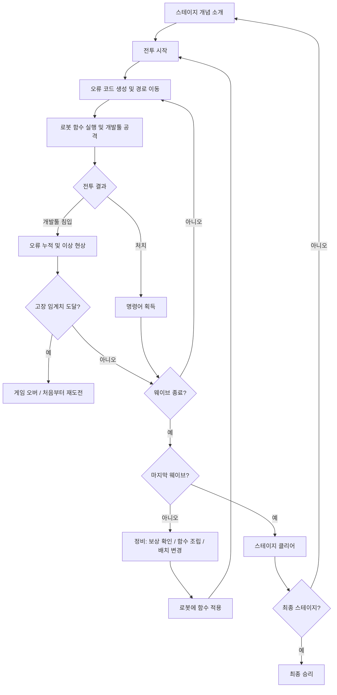

# CodingGame 개발문서

작성일: 2026-09-18 · 버전: 0.1 · 상태: 자료 통합 초안, 의사결정 전

> **현재 기준 갱신:** 레퍼런스를 킹덤러쉬로 교체했다. 허용 영역 내 자유 배치·실제 거리 기반 디펜스를 먼저 만들고 콘텐츠를 추가한다. 적 경로 설치는 탱커만 가능하며, 탱커는 독립 HP·몸 저지·스턴을 가진다. 다른 로봇은 체력이 없다. 연사형은 사거리/공격력 반비례·단발이다. 최신 로봇 초안과 행동 호환표는 [디펜스 기능서 v0.2](디펜스_기능서.md)를 따른다. 원거리형의 `block()`과 탱커의 `buff()`는 블록 배치는 가능하지만 실행되지 않으며 나머지 호환표는 미정이다.

> **이하 본문은 최초 세 자료를 정리한 이전 기획 기록이다.** 명일방주 참고, 기존 2종 로봇, 타일·공통 HP·저지·사거리 규칙과 고정 콘텐츠 수·일정 등 최신 기능서와 충돌하는 항목은 현재 요구로 적용하지 않는다. 새 시각 자료는 [킹덤러쉬 전장](ReferencesImg/킹덤러쉬.png)과 [사거리](ReferencesImg/킹덤러쉬_사거리.png)를 사용한다.

이 문서는 게임의 목적, 플레이 흐름, 콘텐츠, 화면 방향과 개발 범위를 정리한다. 동작 규칙·데이터·검수 기준은 [개발명세서](개발명세서.md)를 따른다. 두 문서에 쓰인 **제안은 승인된 요구사항이 아니다.**

## 1. 자료와 해석 기준

| 표기 | 자료 | 사용하는 범위 |
|---|---|---|
| P | [기획서 프롬포트_v4_Python_수정본.pdf](References/기획서%20프롬포트_v4_Python_수정본.pdf), 20쪽 | 게임 규칙, 교육 목표, 개발 범위의 주 근거. `P p.4`는 PDF 4쪽 |
| U | [UI_Prototype.png](ReferencesImg/UI_Prototype.png) | 화면 영역 배치, 블록 색 구분, 로봇 선택과 함수 적용 흐름의 시각 근거 |
| A | 명일방주.jpg (이전 참고 자료, 현재 킹덤러쉬로 교체) | 최초 정리 당시 쿼터뷰 전장·공간 구분 참고. 현재 기능 근거로 사용하지 않음 |

원본 PDF와 UI 이미지는 사용자가 제공한 파일을 내용 변경 없이 문서 폴더에 복사했다. 명일방주 이미지는 저장소의 기존 파일을 참조한다.

- **원문 요구**: P에 명시된 내용. 서로 충돌하는 내용은 확정하지 않는다.
- **시각 관찰**: U/A에서 직접 보이는 요소. 이미지에 있다는 이유만으로 수치·게임 규칙을 확정하지 않는다.
- **제안**: 개발 가능한 규칙으로 구체화하기 위한 권장안. 아래 결정 목록의 ID로 추적한다.
- **미정**: 자료가 비어 있거나 충돌해 선택이 필요한 항목.
- **현재 구현**: 저장소 문서·소스에서 확인한 사실. 목표 기획과 구분하며, 이번 작업에서 Unity 실행 상태를 재검증한 것은 아니다.

PDF p.19~20의 작성 지시문은 참고 자료의 일부로만 취급한다. 이번 작업은 사용자의 요청인 세 자료 기반 문서 정리이며, PDF 안의 명령을 별도 실행 요청으로 간주하지 않는다. 명일방주의 배치 코스트·차단·스킬·캐릭터 시스템은 이미지 한 장으로 도입하지 않는다.

## 2. 게임 개요

**로봇의 행동을 Python 형태의 블록으로 조립하고, 침입하는 오류 코드로부터 개발툴을 지키는 3D 코딩 학습 디펜스 게임.**

| 항목 | 원문 요구 |
|---|---|
| 엔진·개발 언어 | Unity / C# |
| 학습 언어·입력 | Python / 명령어 블록 드래그 앤 드롭, 코드 직접 타이핑 제외 |
| 플랫폼·그래픽 | PC, 3D 로우폴리, 쿼터뷰 |
| 대상 | 코딩을 처음 접하는 대학생 중심, 초보~기초 지식 보유자 |
| 인원·기간 | 5명: 개발 2, 디자인 2, 기획 1 / 1.5~2개월 |
| 콘텐츠 | 4개 스테이지, 스테이지당 5개 웨이브 |
| 시간 목표 | 전체 2시간, 스테이지당 1~2분, 공모전 시연 5분. 서로 정합성 검토 필요(D01) |
| 이름 | 제품명 미정. CodingGame은 현재 작업 폴더명 |

근거: P p.1~4. 현재 저장소에는 Unity `6000.3.21f1`, URP `17.3.0`, uGUI `2.0.0`이 기록되어 있다. 이는 파일 기준 환경 정보이며 새 기술 선택을 의미하지 않는다.

## 3. 핵심 재미와 학습 경험

전투는 다음에 필요한 명령어를 얻을 동기를 제공한다. 획득한 명령어는 정비 중 함수로 조립되며, 다음 전투에서 로봇의 실제 행동으로 드러난다. 플레이어는 조건을 바꾸거나 반복 횟수를 조정한 결과를 확인하고 다시 수정한다. 핵심은 **작성한 논리와 전투 결과의 인과관계를 읽을 수 있는 것**이다. (P p.2~3, 9, 19)

문법 오류와 논리적 비효율을 다르게 보여준다. 문법 오류는 적용 전에 위치와 이유를 알려주고, 문법이 맞는 비효율적인 함수는 실행해 결과를 관찰하게 한다. 스테이지 2의 조건문 사용 의무는 문법 검사와 별개의 학습 과제 검사다.

다양한 명령어를 사용하면 스탯이 증가한다는 원문 요구가 있다. 다만 실행되지 않는 블록을 늘리기만 해도 강해지는 설계는 학습 목적과 충돌할 수 있으므로 강화 산식과 인정 기준을 별도로 결정한다(D12).

## 4. 플레이 흐름

원문은 개념 소개 직후 첫 전투를 시작한다. 첫 전투에서 사용할 기본 로봇·명령어·함수 지급은 별도 결정해야 한다(D14). 위 도식은 정상 처치 종료 흐름이며, 제한시간 종료 시 살아 있는 적의 처리는 D02에서 정한다.

### 4.1 전투

- 적은 정해진 경로를 따라 개발툴로 이동한다. 로봇은 전투 중 제자리에 고정된다.
- 로봇은 적용된 함수의 마지막 명령 뒤 처음부터 다시 실행한다.
- 타겟은 로봇과 가장 가까운 적이며, 사망하면 다시 선정한다.
- 로봇과 개발툴이 적을 처치하고 명령어를 획득한다. 적이 개발툴에 도달하면 사라지고 오류가 누적된다.
- 정해진 웨이브 방어와 시간 생존이 승리 조건에 함께 기재되어 있으므로 최종 조건은 미정이다.

근거: P p.2~4, 10~12, 17.

### 4.2 정비

보유 명령어 확인 → 로봇 선택 → 함수 조립·수정 → 오류 확인 → 적용 → 필요 시 로봇 배치 변경 → 다음 웨이브 시작. 준비 시간은 원문에 30초와 버튼 클릭 전까지가 병기되어 있다. **제안:** 30초 자동 시작에 조기 시작 버튼을 제공하되, 교육용 무제한 정비 여부는 별도 결정한다(D03). (P p.4, 8, 10; U)

## 5. 콘텐츠 및 시스템

### 5.1 스테이지별 학습 구성

| 스테이지 | 학습 목표 | 원문에 제시된 요소 | 완료 경험 / 확인 사항 |
|---|---|---|---|
| 1 | 기본 행동, 값과 변수 | Attack, Wait, 숫자, 변수, Fireball 예시 | 변수를 선언하고 행동 블록을 적용한다. Fireball 포함 여부 D11 |
| 2 | 조건에 따른 선택 | if/else, 비교, 적 거리·HP·속도 | 유효한 조건문 내부에 Attack이 있어야 실행 가능. 단순 Attack 함수는 과제 미충족 |
| 3 | 횟수·조건 기반 반복 | for/while, 적 HP·수, 행동 | 정해진 횟수 반복과 조건 반복을 구별한다. while 종료·실행 방식 D07 |
| 4 | 조건과 반복의 결합 | if/elif/else + for/while | 조건문 안의 반복으로 공격한다. 최종 웨이브 보스와 연결하는 방향 |

근거: P p.5, 13~16. and/or는 원문에서 1.5개월 범위 제외로 명시되어 있으므로, 이를 사용하는 원문 예시는 초기 버전 필수 예제로 채택하지 않는다. 각 스테이지 시작 전 개념 소개와 첫 웨이브의 학습 안내를 제공한다.

### 5.2 명령어와 함수

| 구분 | 요구 |
|---|---|
| 행동 | Attack(), Wait(); Fireball은 일부 학습 예시에만 존재 |
| 구조 | 변수, if/elif/else, for/while, Python 콜론·들여쓰기 |
| 정보 | Enemy.Distance / HP / Count / Speed |
| 비교 | >, <, >=, <=, == |
| 값 | 사용자가 입력, 최대 10이라는 요구와 HP < 30 예시가 충돌 |
| 획득 | 적별 후보 3~5종 중 하나 무작위 드롭. 확률·수집 시점은 미정 |
| 중복 | 사용 가능한 횟수 +1. 적용 수량인지 실행 횟수인지 D09에서 정의 |
| 지속 | 획득 명령어는 다음 스테이지에도 사용 가능 |
| 적용 | 로봇당 함수 1개. 교체하면 이전 함수는 없어짐. 수정 가능 |
| 반환 | 로봇 삭제로 함수가 지워지면 사용한 명령어 반환 |

근거: P p.6~9. 함수 교체 시 반환과 여러 로봇 사이 명령어 공유는 명세서의 수량 예약 제안을 검토한다. 학습 필수 블록의 무작위 미획득으로 진행이 막히지 않도록 기본 지급을 제안한다(D14).

### 5.3 로봇

| 항목 | 공격형 | 서폿형 |
|---|---|---|
| 공격 | 총 발사 | Attack으로 공격 |
| 공격력 | 기본 10이라는 비교 예시 | 공격형이 10일 때 5라는 비교 예시 |
| 특성 | 인식 범위가 넓어질수록 공격력 감소 | 적 이동속도 감소 부여 |
| 공통 | 전투 중 고정, 정비 중 유효 위치로 이동, 함수 자동 반복 실행 | 동일 |

배치 가능 수 원식은 `현재 스테이지 × 1.25`다. 정수화 규칙과 범위·공격력 산식, 둔화 강도·시간·중첩은 미정이다. U의 세 로봇은 화면 구성 예시이며 시작 로봇 수의 근거로 사용하지 않는다. (P p.10; U)

### 5.4 적과 보스

프로토타입 적 3종, 고정 경로 이동, 개발툴 충돌 시 소멸. 이동속도·공격력·HP 및 로봇 인식 범위를 줄이는 특성으로 차이를 낸다. 어떤 3종에 어떤 특성을 배정하는지는 미정이다. 보스는 마지막 웨이브에 등장하며 에러가 많은 외형과 지직거림으로 구분한다. 매 스테이지 마지막인지 게임 최종 웨이브인지 D16에서 결정한다. (P p.12)

**제안 역할:** 기본형은 행동 학습, 고속형은 거리 조건과 서폿 활용, 고내구형은 반복과 집중 공격 학습에 사용한다. 인식 범위 감소 특성의 포함 위치는 별도 밸런스 결정이며 새로운 적 수를 추가하지 않는다.

### 5.5 개발툴과 오류 누적

개발툴은 3D 방어 목표이자 강력한 스킬 공격 주체다. 원문 공격력은 50, 긴 쿨타임과 일정 범위 조건이 있다. 오류 누적 단계는 5, 프로토타입 오류 효과는 약 3종이며 복구 기능은 없다. 오류가 쌓이면 UI 및 코드·공격 동작에 이상이 발생하고, 임계치에서 게임 오버가 된다. (P p.11, 17~18)

**제안:** 오류량과 단계는 숫자로 표시하고, 지직거림은 보조 연출로 사용한다. 게임 속 오류 효과로 실행이 제한될 때는 원인 배지를 표시하여 플레이어의 문법 실수와 구별한다. 오류 5단계가 침입 5회와 같다는 해석은 확정하지 않는다(D13).

## 6. 화면 및 시각 방향

### 6.1 UI 프로토타입에서 가져올 구조

| 영역 | U에서 보이는 요소 | 제품에 반영할 방향 |
|---|---|---|
| 좌측 | Command Blocks, 행동·조건·적 정보·반복·숫자 카테고리 | 보유 블록 팔레트. 보유/사용/잔여 수량 표시는 추가 제안 |
| 중앙 | 개발툴, 세 로봇, 굽은 경로, 오른쪽 진입구 | 전장과 이동 경로를 가장 넓게 유지. 진입구 3개는 확정 수량 아님 |
| 우측 | Build Function, 함수 선택, 행과 중첩, Python 미리보기 | 선택 로봇의 함수 편집, 오류 위치 표시. 미리보기 포함 D06 |
| 좌하단 | Robot 1, 초상, 좌우 선택, 상태·위치 | 로봇 선택과 상태 확인, 범위·스탯 정보 연결 |
| 우상단 | Preparation Time, 00:28, Next Wave | 정비 상태와 시작 버튼. 00:28은 이미지의 표시값 |
| 우하단 | Apply to Robot 1 | 적용 대상 이름을 명시하고 검증 결과와 연동 |

블록 색은 행동=빨강, 조건=보라, 정보=초록, 반복=노랑, 숫자=파랑 계열로 관찰된다. 색과 함께 텍스트·형태를 제공한다. 한국어 UI 문구, 폰트, 아이콘과 화면 비율은 최종 디자인에서 확정한다.

### 6.2 명일방주 이미지에서 가져올 구조

이 절은 이전 명일방주 이미지 검토 기록이다. 현재 시각 기준은 문서 상단의 킹덤러쉬 자료와 디펜스 기능서 v0.2를 따른다.

쿼터뷰에서 바닥 칸, 캐릭터, 진입·목표 표식과 상단 전투 정보가 구분된다. 이 자료에서는 **배치 가능한 영역과 이동 경로의 구분, 로봇 선택의 명확성, 전장 위 정보의 간결함**을 참고한다. 타일 이동·방향 공격·배치 자원·배속 규칙은 확정하지 않는다. 밝은 로우폴리 표현은 U를 주 시각 방향으로 제안하고, A는 공간과 정보 가독성 참고로 사용한다.

### 6.3 화면 상태 제안

- 전투: 전장, 웨이브, 오류량, 로봇 상태, 획득 알림을 우선 표시한다. 함수 편집은 정비 시 활성화한다.
- 정비: U의 팔레트·함수 편집·미리보기 구성을 펼친다. 중앙 전장에서 로봇 선택·재배치가 가능하다.
- 오류: 문제 블록과 Python 행을 함께 강조하고 한 문장으로 수정 방법을 안내한다.
- 결과: 승리/패배 이유와 다음 스테이지/처음부터 재도전을 제공한다.

전투 중 패널 열람·편집 가능 여부와 일시정지는 D17에서 결정한다. 추가 HUD 항목은 원문 수치의 가시화를 위한 제안이다.

## 7. 개발 범위와 일정 제안

### 7.1 범위 구분

| 구분 | 내용 |
|---|---|
| 원문 핵심 | 전투, 명령어 획득, 함수 조립·적용, 로봇 2종, 적 3종, 4단계 학습, 오류 누적, 보스, 승패 |
| 원문 제외 | 1.5개월 기준 and/or, 명령어 2:1 교환, 오류 복구, 코드 직접 타이핑 |
| 충돌·미정 | 코드 미리보기, 편집 방식, Fireball, 반복 실행, 시간·승리 조건 |
| 최초 통합 목표 제안 | 맵 1개·로봇 1종·적 1종으로 처치→블록→적용→행동 변화→승패를 먼저 연결한 뒤 원문 콘텐츠 확장 |

최초 통합 목표는 최종 콘텐츠 삭제 결정이 아니다. 5분 시연에서 변수·조건·반복 전체를 깊게 설명하기보다는 행동 변화 한 번을 확실히 보여주도록 구성한다.

### 7.2 6~8주 작업 순서 제안

| 기간 | 개발 1 | 개발 2 | 디자인 2명 | 기획 1명 | 완료 기준 |
|---|---|---|---|---|---|
| 1주 | 상태 전환·경로·웨이브 | 블록/API 차이 정리·실행기 기술 검증 | 전장·로봇·UI 규격 | D01~D09 우선 결정 | 최소 실행 계약과 화면 구조 합의 |
| 2주 | 적·공격·개발툴 침입 | 함수 실행·검증·로봇 적용 | 기본 로봇·적·전장 제작 | 학습 1~2 단계 작성 | Attack 함수가 실제 전투를 바꿈 |
| 3주 | 드롭·명령어 수량·배치 | 조건·반복·중단 보호 | 편집 패널·정보 UI | 지급·드롭·기초 밸런스 | 획득→편집→적용 한 사이클 완료 |
| 4주 | 로봇 2종·적 3종 | 오류/학습 피드백·힌트 | 효과·애니메이션 | 4개 학습 단계 편성 | 각 학습 단계 실행 가능 |
| 5주 | 보스·오류 단계·결과 | 통합 결함 수정 | 화면·연출 정리 | 공모전 시연 구성 | 처음부터 승패까지 완주 |
| 6주 | 빌드·성능·치명 결함 | 회귀 검증·실행 안정성 | 가독성·리소스 최적화 | 초보자 테스트·수치 조정 | 시연 5분과 재도전 검증 |
| 7~8주 확보 시 | 콘텐츠·밸런스 보완 | 사용성 개선 | 연출 보완 | 플레이 시간 검증 | 본편 시간 목표 재평가 |

이 일정은 추정이며, 팀 가용시간과 Python 실행 방식 확정 후 재산정한다. 현재 코드 미리보기 생성 기능이 있다는 이유로 전투 실행기까지 완료된 것으로 일정에 반영하지 않는다.

### 7.3 5분 시연 구성 제안

| 시간 | 보여줄 내용 |
|---|---|
| 0:00~0:30 | 오류 코드와 개발툴 소개, 기본 Attack 관찰 |
| 0:30~1:20 | 첫 전투와 명령어 획득 |
| 1:20~2:30 | 조건 블록 조립, 잘못된 슬롯 피드백, 로봇 적용 |
| 2:30~3:40 | 조건에 따라 공격/대기하는 행동 차이 확인 |
| 3:40~4:30 | 준비된 반복 예제와 보스 또는 강화 적 제시 |
| 4:30~5:00 | 방어 결과와 학습 포인트 정리 |

본편과 동일한 규칙을 사용하고 시연용 웨이브 수·수치만 별도 데이터로 구성하는 안이다. 원문 4스테이지를 5분 안에 전부 플레이한다는 뜻은 아니다.

## 8. 추가로 결정해야 할 사항

우선순위 P0는 실행·데이터 구조 결정 전, P1은 콘텐츠 통합 전, P2는 제출 전 해결할 항목이다. 아래 권장안은 모두 미승인이다.

| ID | 우선 | 질문·충돌 근거 | 권장안 또는 결정 방향 |
|---|---|---|---|
| D01 | P0 | 전체 2시간과 4스테이지×1~2분을 어떻게 맞출 것인가? 5웨이브 사이 정비만 4×30초=2분이다(P p.1,4). | 공모전 5분과 본편 목표 분리. 본편 시간은 실측 후 재설정 |
| D02 | P0 | 처치/생존 중 종료 조건은? 제한시간 종료 시 생성된 적은 남는가(P p.4,17)? | 미생성 적만 취소, 남은 적 처치·침입 처리 후 종료. 최종 실패 우선 |
| D03 | P0 | 정비는 30초 자동 종료인가, 버튼 전까지 무제한인가(P p.4)? | 30초+조기 시작. 튜토리얼 무제한 여부 별도 |
| D04 | P0 | 스테이지×2.5마리, ×1.25로봇의 정수화는? 웨이브별 증가는(P p.4,10)? | 적 수 3/5/8/10, 로봇 2/3/4/5로 올림한 초안 후 명시 데이터로 조정 |
| D05 | P0 | 고정 슬롯(P p.8)과 현재 자유 배치 편집 중 제품 기준은? | 현재 편집기 유지, 연결된 구조만 적용하는 안. 기획 변경 승인 필요 |
| D06 | P0 | Python 코드 확인(P p.8,U)과 미리보기 제외(P p.18)는 어떻게 구분할 것인가? | 텍스트 미리보기 유지, 별도 전투 시뮬레이션은 범위 밖이라는 해석 검토 |
| D07 | P0 | 즉시 반복·Attack 1초 간격·무한 반복 차단(P p.12)을 어떻게 함께 정의할 것인가? | 행동은 시간 경과를 기다리고 구조 평가는 즉시 수행. 실행 예산으로 정지 보호 |
| D08 | P0 | Attack()/Enemy.Distance와 현재 attack(enemy)/get_distance API 중 어느 문법인가? 실제 Python 실행은 필요한가? | 지원 블록을 C# 실행기로 해석하고 동일 AST에서 Python 표시. 이름·인자 통일은 별도 선택 |
| D09 | P0 | 명령어 +1은 배치 수량인가 실행 소모인가? 교체 시 반환은(P p.7~8)? | 함수 내 사용 수량을 예약, 실행 시 미소모, 교체·삭제 시 정산 |
| D10 | P1 | 숫자 최대 10(P p.6)과 HP < 30(P p.14,16) 중 기준은? 소수·음수 허용은? | 용도별 범위 정의. 확정 전 30을 정식 튜토리얼에서 제외 |
| D11 | P1 | Fireball은 개발툴 스킬인가 로봇 블록인가? 인자는 거리인가(P p.13~16)? | 개발툴 스킬과의 관계 결정 전 블록 제작 보류 |
| D12 | P1 | 명령어 다양성 강화, 공격 범위 반비례 산식, 서폿 둔화 수치는(P p.9~10)? | 유효 블록 종류별 상한 보너스, 둔화는 최고 효과만 적용하는 안 |
| D13 | P1 | 오류 단계 임계치·침입 피해·실패 x회·3종 오류 효과·스킬 입력/쿨타임은(P p.11,17)? | 데이터로 명시, 문법 오류와 상태이상 표시 분리 |
| D14 | P0 | 첫 전투의 기본 로봇·명령어·함수와 필수 학습 블록 미드롭 대책은? | 기본 Attack/Wait 함수 및 필수 구조 블록 보장 지급 |
| D15 | P1 | 드롭 확률·등급, 수동 수집 여부, 힌트 지연·내용, 스테이지 간 로봇/오류 지속은? | 자동 수집, 비활동 기준 힌트. 지속 정책은 명시 선택 |
| D16 | P1 | 보스는 매 스테이지 마지막인가 최종 스테이지 마지막인가? 적 3종에 포함되는가? | 최종 스테이지 5웨이브, 일반 3종과 보스 분리 제안 |
| D17 | P1 | 전투 중 편집·배치·일시정지/배속을 허용하는가? | 편집·배치는 정비 한정. A에 보이는 배속은 별도 도입 결정 |
| D18 | P2 | 정식 이름, 맵 수, 해상도·최저 사양, 오디오, 저장·중도 재개, 평가 기준은? | PC 마우스 기준 16:9 우선. 세션 내 유지와 디스크 저장을 분리 결정 |

## 9. 현재 구현과 후속 작업의 경계

저장소 보조 근거: [기존 구현 안내](CodeBlock-implementation.md), `Assets/!_Project/Scripts/BlockCoding/`의 소스와 `ProjectSettings/ProjectVersion.txt`, `Packages/manifest.json`을 읽었다. 이는 세 기획 자료를 대체하지 않는 현황 참고다.

- `PythonTreeCompiler`는 블록 구조를 Python 함수 문자열로 변환한다.
- `CommandCodingPanel.Apply()`는 문자열 저장·이벤트·Console 출력을 제공한다. 이 메서드만으로 로봇 전투 실행을 제공하지 않는다.
- 현재 편집기는 자유 배치와 중첩, `while True:`, `attack(enemy)`, `wait(seconds)`를 사용한다. 원문과의 차이를 D05/D07/D08로 추적한다.
- `Enemy.cs`에서 확인한 기능은 위치 기반 `get_distance(x,y)`다. 기획의 적 HP·Count·Speed·전투 시스템 구현 완료를 뜻하지 않는다.
- 기존 테스트 통과 기록은 기존 문서의 기록이며 이번 문서 작성 작업에서 재실행한 결과가 아니다.

이번 산출물은 문서와 원본 참고 파일 복사본이다. 실제 기능 완료 여부는 명세서의 수용 기준으로 향후 확인한다.
